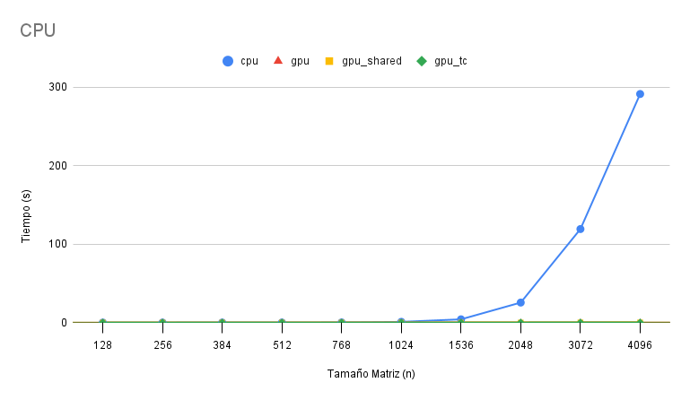
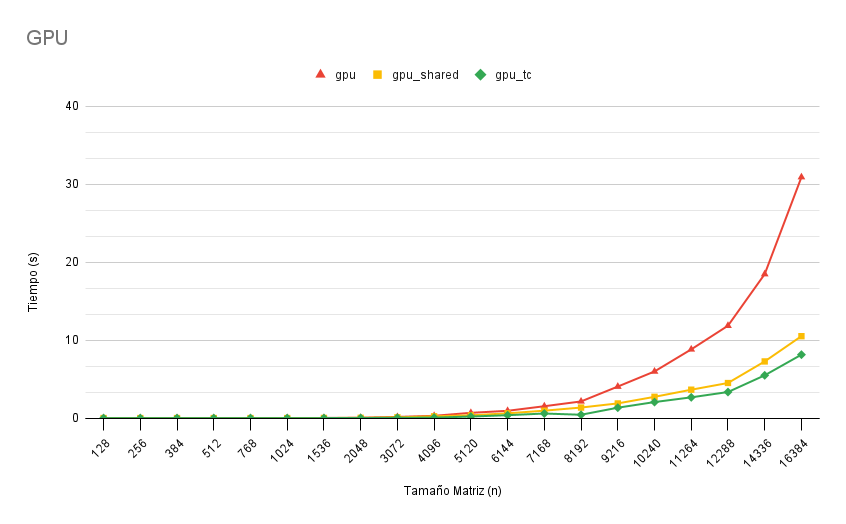

# info188-matmul

## Introducción

###### Integrantes:
- Eduardo Montecinos
- Cristóbal Silva
- Diego Soto
- Matías Soto
- Matías Toledo

La multiplicación de matrices es una operación fundamental en la computación, como se nos ha mencionado en clases, para la simulación física y el entrenamiento de redes neuronales. Al tratarse de una operación con complejidad secuencial de orden cúbico, la manera en que se implementa puede tener un impacto significativo en el rendimiento y eficiencia de los sistemas, con el riesgo de que se dispare el runtime en función del tamaño de las entradas. Por ello, resulta crucial explorar opciones de paralelización para reducir el tiempo de cómputo excesivo.

En esta tarea se implementó la multiplicación de matrices con diferentes aplicaciones de procesamiento en paralelo:
1. Paralelismo en CPU 🔵
2. Paralelismo en GPU básico (con el approach tratado en clases) 🔴
3. Paralelismo en GPU con **memoria compartida** 🟡
4. Paralelismo en GPU con **tensor cores** 🟢

El paralelismo en CPU fue programado con OpenMP (`#pragma omp parallel for`), mientras que las otras tres opciones se trabajaron con CUDA (NVIDIA). Los cuatro enfoques se encuentran en el mismo archivo [`main.cu`](./main.cu), que se compila con `make` y se ejecuta como:
```bash
./prog <n tamaño matriz> <número de threads CPU> <opción 1-4 de algoritmos>
```

Con el fin de evaluar el rendimiento de cada opción, se realizaron pruebas utilizando diferentes tamaños de entrada (matrices cuadradas `n*n`) y se midió el tiempo de ejecución en cada caso. Con los tiempos medidos, también se determinó el speedup/aceleración de las tres implementaciones en GPU con respecto al paralelismo en CPU.

---

## Resultados

A partir de los experimentos realizados, se observa una diferencia de rendimiento sustancial entre la ejecución paralelizada en CPU y la ejecución con hilos en GPU.

### Salto de tiempos de ejecución CPU vs GPU



Como se evidencia en la tabla de resultados y en los gráficos, el tiempo de ejecución en la CPU crece drásticamente a medida que aumenta el tamaño de la matriz (cuadrada `n*n`). En el primer gráfico se distingue que, al llegar a `n = 3072`, el runtime alcanza las centenas de segundos, mientras que en las tres implementaciones paralelizadas en GPU las curvas se mantienen considerablemente cercanas al eje de las abscisas (en esta escala gráfica resultan indistinguibles).

En el caso `n = 4096`, la implementación en CPU tardó **291.12 segundos**, mientras que la implementación básica/directa en GPU tardó **0.29 segundos**. Este caso representa un speedup de aproximadamente **989x**. La brecha en runtime se debe no solo a que la CPU está limitada por un número mucho menor de núcleos físicos (6 núcleos, 12 hilos en el Ryzen 5 3600 utilizado), sino también por la latencia de acceso a la memoria, contrastada con la capacidad superior de la GPU de explotar el paralelismo en cargas masivas de trabajo aritmético.

### Memoria global y memoria compartida



En el segundo gráfico se observa que la implementación básica en GPU (enfoque _naive_, línea roja) se degrada en rendimiento más rápido que las otras dos versiones a medida que aumenta `n`. Esto es porque la opción básica en GPU calcula las componentes de la matriz con accesos repetidos a la **memoria global** para obtener los valores en `A` y `B`. Como no existe reutilización de datos entre hilos de la GPU, estos tardan más en acceder a los datos de entrada que en calcular las componentes de salida.

La curva amarilla, por otro lado, exhibe una mejora notable en redimiento. El uso de _tiling_ (con `TILE_SIZE 16`) permite que los hilos de un bloque carguen bloques de `A` y `B` mediante accesos coalescentes a memoria global y luego reutilicen esos datos desde memoria compartida, reduciendo drásticamente el número de accesos globales. Con `n = 16384`, la implementación en GPU básica demora **30.89 segundos**, mientras que la versión que aprovecha la shared memory tarda **10.51 segundos**.


### Multiplicación de matrices con tensor cores

Finalmente, la razón por la que la versión con **GPU tensor cores** supera a las demás es que aprovecha **unidades de cómputo especializadas** diseñadas para la **multiplicación de matrices de tamaño fijo**. Estas unidades pueden realizar una cantidad significativamente mayor de operaciones de punto flotante por ciclo de reloj que los CUDA cores convencionales.

La multiplicación se ejecuta de forma **cooperativa a nivel de warp** (unidad de 32 hilos), utilizando **fragmentos WMMA** de tamaño fijo. Mediante la instrucción `mma_sync`, un warp completo realiza la operación entre dos bloques (16×16) de las matrices de entrada y acumula el resultado en un bloque del mismo tamaño, reemplazando múltiples operaciones aritméticas escalares por una única instrucción especializada.

Además, la matriz de entrada `B` se transpone previamente para favorecer **accesos coalescentes a memoria**.

Es importante notar que parte de la aceleración obtenida con tensor cores se debe a la precisión reducida, ya que las matrices de entrada se representan en formato **half (16 bits)** en lugar de **float (32 bits)**, como son originalmente recibidas. La tarjeta utilizada **RTX 2060 Super** presenta un rendimiento teórico aproximado de **14.36 TFLOPS en FP16**, frente a **7.181 TFLOPS en FP32**, por lo que la conversión a FP16 permite al programa aprovechar este rendimiento ventajoso. Esta conversión introduce un overhead adicional en el tiempo de ejecución medido, que podría evitarse si las entradas ya estuvieran originalmente en dicho formato.


## Hardware utilizado para los tests
### CPU
|Especificaciones CPU||
|-|-|
|Marca|AMD|
|Modelo|Ryzen 5 3600|
|Frecuencia|3.6 GHz|
|Frecuencia turbo|Hasta 4.2 GHz|
|Núcleos|6|
|Hilos|12|
|Cache L1|64 KB (por núcleo)|
|Cache L2|512 KB (por núcleo)|
|Cache L3|32 MB (compartido)|

### RAM
|Especificaciones RAM||
|-|-|
|Capacidad|32 GB (_Dual channel, 4x8 GB_)|
|Tipo|DDR4|
|Frecuencia|3000 MHz|

### GPU
|Especificaciones GPU||
|-|-|
|Marca|NVIDIA|
|Modelo|RTX 2060 Super|
|Procesador gráfico|TU106|
|Arquitectura|_Turing_|
|Reloj base|1470 MHz|
|Reloj boost|1650 MHz|
|VRAM|8 GB|
|Tipo VRAM|GDDR6|
|Ancho de banda VRAM|448.0 GB/s|
|CUDA Cores|2176|
|Tensor Cores|272|
|Tensor Cores por SM|8|
|Rendimiento FP16 (half)|14.36 TFLOPS|
|Rendimiento FP32 (float)|7.181 TFLOPS|
|Rendimiento FP64 (double)|224.4 GFLOPS|
|Versión CUDA|7.5|

---

## Referencias
#### Shared memory
- [Mutliplicación matrices memoria compartida](https://medium.com/@dhanushg295/mastering-cuda-matrix-multiplication-an-introduction-to-shared-memory-tile-memory-coalescing-and-d7979499b9c5)

#### Tensor cores
- [Documentación oficial de Nvidia sobre Tensor cores](https://developer.nvidia.com/blog/programming-tensor-cores-cuda-9/)
- [Blog explicativo sobre la programación sobre Tensor cores](https://leimao.github.io/blog/NVIDIA-Tensor-Core-Programming/)
- [Video explicativo sobre programación en Tensor cores](https://youtu.be/Yt1A-vaWTck?si=3m5EwRk-dz3hGI70)

#### Hardware
- [Especificaciones RTX 2060 Super](https://www.techpowerup.com/gpu-specs/geforce-rtx-2060-super.c3441)
- [Especificaciones Ryzen 5 3600](https://www.techpowerup.com/cpu-specs/ryzen-5-3600.c2132)
